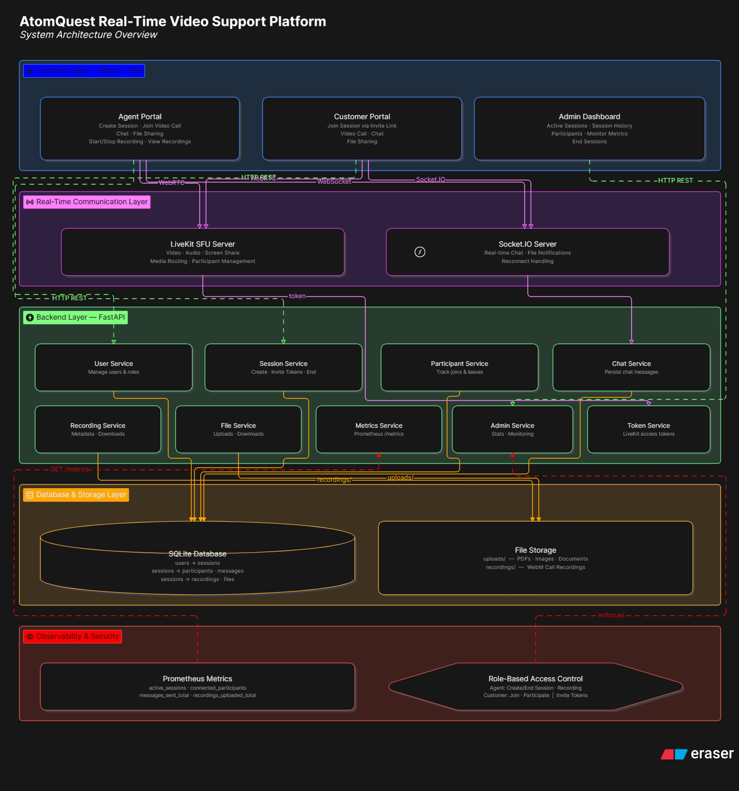

# AtomQuest Real-Time Video Support Platform

A browser-based customer support platform enabling agents and customers to conduct real-time video-assisted support sessions.

The platform provides:

- Video & Audio Calling
- Real-Time Chat
- File Sharing
- Session Recording
- Admin Dashboard
- Monitoring & Metrics

## Features

### Core Features

- Agent creates support sessions
- Customer joins using invite link/token
- Browser-based video calling
- Browser-based audio calling
- Real-time chat
- Session history tracking
- Role-based access control

### Bonus Features

- Call recording
- Recording downloads
- File sharing
- Admin dashboard
- Metrics endpoint
- Reconnect handling

## Architecture

## Tech Stack

Frontend

- React
- Vite
- TailwindCSS

Backend

- FastAPI
- SQLAlchemy
- Socket.IO

Database

- SQLite

Real-Time Communication

- LiveKit SFU
- WebRTC

Monitoring

- Prometheus Metrics

## Project Structure

frontend/
backend/

backend/app/
├── api
├── models
├── services
├── sockets
├── db

uploads/
recordings/

## Backend Setup

cd backend

python -m venv .venv

pip install -r requirements.txt

uvicorn app.main:app --reload

## LiveKit Setup

docker run --rm \
-p 7880:7880 \
-p 7881:7881 \
-v ${PWD}/livekit.yaml:/livekit.yaml \
livekit/livekit-server \
--config /livekit.yaml

## Frontend Setup

cd frontend

npm install

npm run dev

## Demo Credentials

Agent

- user_id = 1

Customer

- user_id = 2

## List of Major endpoints

- POST /sessions
- POST /video/token
- GET /chat/{session_id}
- POST /recordings/upload
- POST /files/upload
- GET /admin/overview
- GET /metrics

## Future Improvements

- Multi-agent support
- PostgreSQL migration
- Cloud object storage
- Automated recording processing
- Advanced analytics
